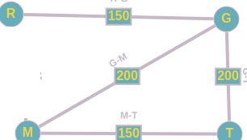

  \\

Viaggio considerato = [R G T]
P = 1 2 ---->  GT
F = 2 1 ---->  RG
Budget P = Budget F = 500
Viaggio considerato = [R G T], io devo comunque toccare le città G T, cerco sempre di toccare queste mete perché è il viaggio che abbiamo selezionato. Se viene a mancare un agente(arco), si cerca un viaggio alternativo che faccia comunque ciò.

Per fare quella tratta, devono esserci i due agenti scelti, altrimenti sono obbligat* a sceglierne un'altra (toccando sempre sia G che T).

Ogni agente rappresenta l'arco della preferenza maggiore nel viaggio.
Per questo motivo Paola gareggia per GT e Francesca per RG.

CostoP = Se Paola non partecipasse (non abbiamo GT), si potrebbe considerare il percorso RGMTR

CP =	(RGMT) - (RGT - GT) = 
   =	500 - (350 - 200) = 500 - 150  = 350

CostoF = Se Francesca non partecipasse, Paola vorrebbe raggiungere G e T ( ma senza francesca non possiamo fare RG, di conseguenza è obbligato a scegliere un altro percorso RMGT).

CF = 	RMGT - (RGT - RG) =
	600 - (350 - 150) = 600 - 200 = 400
	
	
TOTALE = 750
IL VIAGGIO COSTA RGT = 350.

400 rimanenti restituiti a secondo dei km della preferenza scelta.

#### ATTENZIONE, NON CONSIDERO IL RITORNO PERCHE' OGNI ARCO E' UN AGENTE, MA HO CONSIDERATO SOLO 2 PERSONE.
SOLUZIONE? CALCOLARE NEL PERCORSO IL COSTO ANDATA E RITORNO SU OGNI ARCO (RADDOPPIO I COSTI PER OGNI ARCO)

## CASO ESTREMO VOLUTO DA PAOLA

P = 2 0 ---->  RG
F = 2 0 ---->  RG

## PAGANO UGUALE

CostoP = Se Paola non partecipasse (non abbiamo GT), si potrebbe considerare il percorso RGMTR

CP =	(RGMT) - (RGT - GT) = 
   =	500 - (350 - 200) = 500 - 150  = 350

CostoF = Se Francesca non partecipasse (non abbiamo GT), si potrebbe considerare il percorso RGMTR

CF =	(RGMT) - (RGT - GT) = 
   =	500 - (350 - 200) = 500 - 150  = 350
